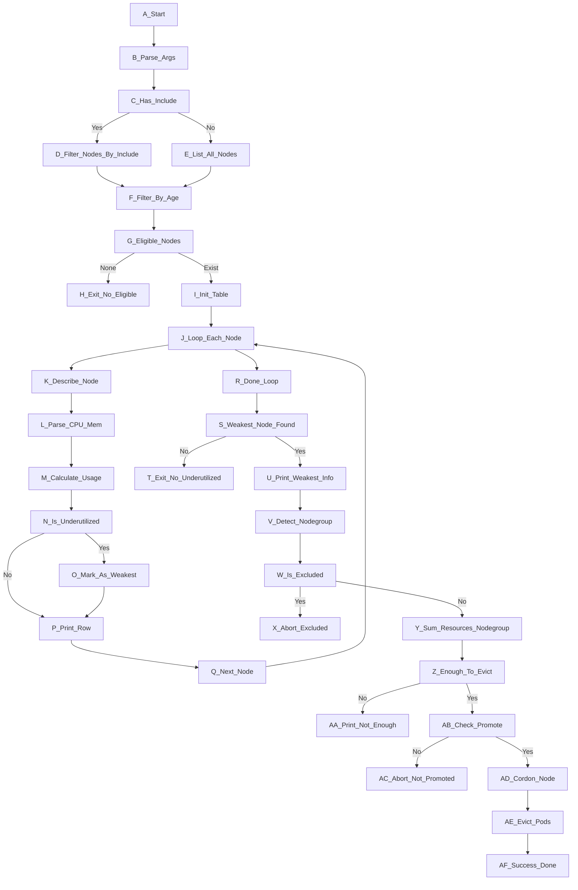

# check-utilized.sh

## 🧭 Mục tiêu

Script này được thiết kế để **tự động phát hiện node Kubernetes đang underutilized** (sử dụng ít tài nguyên CPU + RAM), nhằm chuẩn bị cho các hành động:

- `cordon` node
- `evict` workload
- Giúp cluster autoscaler scale down hiệu quả

## ⚙️ Chức năng chính

- Truy xuất danh sách node trong cluster
- Lọc theo thời gian khởi tạo (loại bỏ node mới scale dưới 1h)
- Phân tích CPU/MEM Request vs Allocatable
- Xác định node yếu nhất (CPU+MEM < 50%)
- Đảm bảo cùng nodegroup có đủ tài nguyên để tiếp nhận workload
- Cho phép thực thi cordon/evict khi được chỉ định

---

## 🛠️ Cách sử dụng

```bash
sh check-utilized.sh [--include="pattern1|pattern2"] [--exclude="groupA|groupB"] [--promote-evict]
```

### 🔹 Tham số hỗ trợ:

| Tham số            | Ý nghĩa |
|--------------------|--------|
| `--include=`       | Regex để lọc node group cần kiểm tra (mặc định: tất cả) |
| `--exclude=`       | Regex loại trừ node group không được cordon/evict |
| `--promote-evict`  | Nếu có, thực thi cordon & evict node yếu nhất, không có chỉ thực hiện in ra báo cáo |

---

## 🚫 Bảo vệ node đặc biệt

Nếu không truyền `--include`, script sẽ **tự động nhóm node dựa vào tên** bằng cách **loại bỏ 2 block cuối trong node name**.  
Tuy nhiên, node thuộc các nhóm **được loại trừ qua `--exclude`** sẽ không bị xử lý, ví dụ:

```bash
--exclude="cp|base|example-exception"
```

---

## 📌 Ví dụ

```sh
sh check-ultilized.sh   --exclude="usrcp|base"
### PHASE I - CHECK NODE UTILIZATION
⚠️ Node pattern group is empty. Auto-grouping nodes based on naming convention.

Node                                     CPU Req         CPU Total       CPU%       Mem Req (GiB)   Mem Total       Mem%       Underutilized?
---------------------------------------- --------------- --------------- --------   --------------- --------------- --------   -----------------
gke-dc1dtu-basev5-7dbbbfb8f7-dn6t8       3.43            7.84            43.7%      6.48            14.28           45.3%      Yes
gke-dc1dtu-basev5-7dbbbfb8f7-gddn4       3.88            7.84            49.4%      5.74            14.28           40.1%      Yes
gke-dc1dtu-basev5-7dbbbfb8f7-kfdhl       3.20            7.84            40.8%      6.90            14.28           48.3%      Yes
gke-dc1dtu-itomv2-559bd6d476-285r7       9.71            15.76           61.6%      22.34           36.65           60.9%      No
gke-dc1dtu-itomv2-559bd6d476-njjbj       8.53            15.76           54.1%      23.14           36.65           63.1%      No
gke-dc1dtu-itomv2-559bd6d476-rxskj       10.81           15.76           68.5%      19.70           36.65           53.7%      No
gke-dc1dtu-itomv2-559bd6d476-wpvb7       9.47            15.76           60.0%      19.45           36.65           53.0%      No
gke-dc1dtu-itomv2-559bd6d476-wq776       9.03            15.76           57.2%      19.64           36.65           53.5%      No
gke-dc1dtu-metallb-6f5b689667-cpdb2      1.05            3.88            27.0%      .71             6.81            10.4%      Yes
gke-dc1dtu-app-1-9-5fdbccdb66-6pf87    7.65            7.84            97.5%      28.79           59.10           48.7%      No
gke-dc1dtu-app-1-9-5fdbccdb66-7nqks    7.35            7.84            93.7%      33.20           59.10           56.1%      No
gke-dc1dtu-app-1-9-5fdbccdb66-ggnf6    4.45            7.84            56.7%      19.11           59.10           32.3%      No
gke-dc1dtu-app-1-9-5fdbccdb66-h2g7v    7.55            7.84            96.3%      37.86           59.10           64.0%      No
gke-dc1dtu-app-1-9-5fdbccdb66-l8ws2    7.75            7.84            98.8%      57.30           59.10           96.9%      No
gke-dc1dtu-app-1-9-5fdbccdb66-qwjfk    7.55            7.84            96.3%      36.29           59.10           61.4%      No
gke-dc1dtu-app-1-9-5fdbccdb66-rr99d    7.65            7.84            97.5%      50.26           59.10           85.0%      No
gke-dc1dtu-appv4-78d9545465-2s4dk      23.66           23.68           99.9%      44.07           44.13           99.8%      No
gke-dc1dtu-appv4-78d9545465-42brl      22.35           23.68           94.3%      38.33           44.13           86.8%      No
gke-dc1dtu-appv4-78d9545465-48b85      12.25           23.68           51.7%      25.50           44.13           57.7%      No
gke-dc1dtu-appv4-78d9545465-4sdk9      23.00           23.68           97.1%      35.91           44.13           81.3%      No
gke-dc1dtu-appv4-78d9545465-5gstv      23.65           23.68           99.8%      25.62           44.13           58.0%      No
gke-dc1dtu-appv4-78d9545465-5mqsv      22.70           23.68           95.8%      38.39           44.13           86.9%      No
gke-dc1dtu-appv4-78d9545465-6jkmg      20.30           23.68           85.7%      37.45           44.13           84.8%      No
gke-dc1dtu-appv4-78d9545465-7s8sx      23.60           23.68           99.6%      35.67           44.13           80.8%      No
gke-dc1dtu-appv4-78d9545465-95kmk      23.05           23.68           97.3%      37.79           44.13           85.6%      No
gke-dc1dtu-appv4-78d9545465-cg2zj      21.25           23.68           89.7%      29.63           44.13           67.1%      No
gke-dc1dtu-appv4-78d9545465-d6bz7      19.56           23.68           82.6%      42.47           44.13           96.2%      No
gke-dc1dtu-appv4-78d9545465-qcmr8      21.95           23.68           92.6%      27.48           44.13           62.2%      No
gke-dc1dtu-appv4-78d9545465-rsb5j      12.40           23.68           52.3%      37.39           44.13           84.7%      No
gke-dc1dtu-appv4-78d9545465-sh2zm      22.90           23.68           96.7%      33.06           44.13           74.9%      No
gke-dc1dtu-appv4-78d9545465-zb8zr      23.40           23.68           98.8%      38.30           44.13           86.7%      No
gke-dc1dtu-usrcp-01                      1.49            3.88            38.4%      .96             14.28           6.7%       Yes
gke-dc1dtu-usrcp-02                      1.53            3.88            39.4%      .89             14.28           6.2%       Yes
gke-dc1dtu-usrcp-03                      1.42            3.88            36.5%      .80             14.28           5.6%       Yes

� Weakest node (CPU+MEM < 50%): gke-dc1dtu-metallb-6f5b689667-cpdb2 (27.0% CPU)
� Checking nodegroup resource availability in group [gke-dc1dtu-metallb]...
❌ Nodegroup does NOT have enough resources to evacuate gke-dc1dtu-metallb-6f5b689667-cpdb2
Free CPU: 0 / Needed: 1.05 (core)
Free MEM: 0 / Needed: .71 (GiB)

```

```sh
sh check-ultilized.sh   --include="app|itom"   --exclude="usrcp|base"
### PHASE I - CHECK NODE UTILIZATION

Node                                     CPU Req         CPU Total       CPU%       Mem Req (GiB)   Mem Total       Mem%       Underutilized?
---------------------------------------- --------------- --------------- --------   --------------- --------------- --------   -----------------
gke-dc1dtu-itomv2-559bd6d476-285r7       9.71            15.76           61.6%      22.34           36.65           60.9%      No
gke-dc1dtu-itomv2-559bd6d476-njjbj       8.53            15.76           54.1%      23.14           36.65           63.1%      No
gke-dc1dtu-itomv2-559bd6d476-rxskj       10.81           15.76           68.5%      19.70           36.65           53.7%      No
gke-dc1dtu-itomv2-559bd6d476-wpvb7       9.47            15.76           60.0%      19.45           36.65           53.0%      No
gke-dc1dtu-itomv2-559bd6d476-wq776       9.03            15.76           57.2%      19.64           36.65           53.5%      No
gke-dc1dtu-app-1-9-5fdbccdb66-6pf87    7.65            7.84            97.5%      28.79           59.10           48.7%      No
gke-dc1dtu-app-1-9-5fdbccdb66-7nqks    7.35            7.84            93.7%      33.20           59.10           56.1%      No
gke-dc1dtu-app-1-9-5fdbccdb66-ggnf6    4.45            7.84            56.7%      19.11           59.10           32.3%      No
gke-dc1dtu-app-1-9-5fdbccdb66-h2g7v    7.55            7.84            96.3%      37.86           59.10           64.0%      No
gke-dc1dtu-app-1-9-5fdbccdb66-l8ws2    7.75            7.84            98.8%      57.30           59.10           96.9%      No
gke-dc1dtu-app-1-9-5fdbccdb66-qwjfk    7.55            7.84            96.3%      36.29           59.10           61.4%      No
gke-dc1dtu-app-1-9-5fdbccdb66-rr99d    7.65            7.84            97.5%      50.26           59.10           85.0%      No
gke-dc1dtu-appv4-78d9545465-2s4dk      23.66           23.68           99.9%      44.07           44.13           99.8%      No
gke-dc1dtu-appv4-78d9545465-42brl      22.35           23.68           94.3%      38.33           44.13           86.8%      No
gke-dc1dtu-appv4-78d9545465-48b85      12.25           23.68           51.7%      25.50           44.13           57.7%      No
gke-dc1dtu-appv4-78d9545465-4sdk9      23.00           23.68           97.1%      35.91           44.13           81.3%      No
gke-dc1dtu-appv4-78d9545465-5gstv      23.65           23.68           99.8%      25.62           44.13           58.0%      No
gke-dc1dtu-appv4-78d9545465-5mqsv      22.70           23.68           95.8%      38.39           44.13           86.9%      No
gke-dc1dtu-appv4-78d9545465-6jkmg      20.30           23.68           85.7%      37.45           44.13           84.8%      No
gke-dc1dtu-appv4-78d9545465-7s8sx      23.60           23.68           99.6%      35.67           44.13           80.8%      No
gke-dc1dtu-appv4-78d9545465-95kmk      23.05           23.68           97.3%      37.79           44.13           85.6%      No
gke-dc1dtu-appv4-78d9545465-cg2zj      21.25           23.68           89.7%      29.63           44.13           67.1%      No
gke-dc1dtu-appv4-78d9545465-d6bz7      19.56           23.68           82.6%      42.47           44.13           96.2%      No
gke-dc1dtu-appv4-78d9545465-qcmr8      21.95           23.68           92.6%      27.48           44.13           62.2%      No
gke-dc1dtu-appv4-78d9545465-rsb5j      13.00           23.68           54.8%      38.02           44.13           86.1%      No
gke-dc1dtu-appv4-78d9545465-sh2zm      22.90           23.68           96.7%      33.06           44.13           74.9%      No
gke-dc1dtu-appv4-78d9545465-zb8zr      23.40           23.68           98.8%      38.30           44.13           86.7%      No

✅ No underutilized node found (CPU+MEM < 50%)
```

- Phân tích các node khớp `app` hoặc `itom`
- Bỏ qua node thuộc `usrcp` hoặc `base`
- Nếu có --promote-evict node yếu và đủ điều kiện → tự động cordon + evict

---

## 📝 Ghi chú

- Phụ thuộc: `kubectl`, `bc`, `awk`, `sed`, `grep`
- Hành vi `cordon.sh` và `evict.sh` cần được định nghĩa sẵn

---

## 🔁 Lưu đồ logic



### 🧭 **Giải thích chi tiết flowchart `check-utilized.sh`**

| ID                            | Diễn giải                                                                           |
| ----------------------------- | ----------------------------------------------------------------------------------- |
| **A_Start**                   | Bắt đầu thực thi script.                                                            |
| **B_Parse_Args**              | Phân tích tham số dòng lệnh: `--include`, `--exclude`, `--promote-evict`.           |
| **C_Has_Include**             | Kiểm tra có truyền `--include` không.                                               |
| **D_Filter_Nodes_By_Include** | Lọc danh sách node theo regex `--include`. Dùng khi muốn kiểm tra nhóm node cụ thể. |
| **E_List_All_Nodes**          | Nếu không truyền `--include`, liệt kê toàn bộ node trong cluster.                   |
| **F_Filter_By_Age**           | Loại node mới spawn dưới 1 giờ (tránh false positive khi node chưa ổn định).        |
| **G_Eligible_Nodes**          | Kiểm tra còn node hợp lệ không sau khi lọc.                                         |
| **H_Exit_No_Eligible**        | Nếu không còn node hợp lệ → thoát, kết thúc.                                        |
| **I_Init_Table**              | In ra tiêu đề bảng thống kê sử dụng tài nguyên.                                     |
| **J_Loop_Each_Node**          | Bắt đầu vòng lặp qua từng node đủ điều kiện.                                        |
| **K_Describe_Node**           | Gọi `kubectl describe node` để lấy thông tin chi tiết.                              |
| **L_Parse_CPU_Mem**           | Trích xuất lượng CPU & Memory request/allocatable từ bảng `Non-terminated Pods`.    |
| **M_Calculate_Usage**         | Tính toán tỷ lệ sử dụng % cho CPU và Memory.                                        |
| **N_Is_Underutilized**        | Nếu CPU < 50% **hoặc** cả CPU + Mem đều thấp → đánh dấu là underutilized.           |
| **O_Mark_As_Weakest**         | Ghi nhận node yếu nhất trong các node underutilized.                                |
| **P_Print_Row**               | In từng dòng bảng, kèm cột "Underutilized?"                                         |
| **Q_Next_Node**               | Chuyển sang node kế tiếp.                                                           |
| **R_Done_Loop**               | Kết thúc vòng lặp toàn bộ node.                                                     |
| **S_Weakest_Node_Found**      | Có node underutilized nào không?                                                    |
| **T_Exit_No_Underutilized**   | Nếu không → kết thúc. Không cần hành động.                                          |
| **U_Print_Weakest_Info**      | In thông tin node yếu nhất được chọn.                                               |
| **V_Detect_Nodegroup**        | Phân tích prefix nodegroup (cắt bỏ 2 block cuối trong tên node).                    |
| **W_Is_Excluded**             | Kiểm tra nodegroup có nằm trong danh sách `--exclude` không.                        |
| **X_Abort_Excluded**          | Nếu có → bỏ qua không cordon/evict node này.                                        |
| **Y_Sum_Resources_Nodegroup** | Tổng hợp lượng tài nguyên dư từ các node cùng group khác (CPU và Mem).              |
| **Z_Enough_To_Evict**         | So sánh xem có đủ tài nguyên để chuyển workload từ node yếu sang không.             |
| **AA_Print_Not_Enough**       | Nếu không đủ tài nguyên dự phòng → dừng, không được phép cordon/evict.              |
| **AB_Check_Promote**          | Kiểm tra có truyền `--promote-evict` không để bật hành động thật sự.                |
| **AC_Abort_Not_Promoted**     | Nếu không có flag `--promote-evict` → chỉ báo cáo, không hành động.                 |
| **AD_Cordon_Node**            | Gọi `kubectl cordon` để chặn node yếu khỏi nhận thêm workload.                      |
| **AE_Evict_Pods**             | Gọi `kubectl drain` hoặc `kubectl evict` để di tản workload.                        |
| **AF_Success_Done**           | Xác nhận hoàn thành quy trình xử lý node yếu.                                       |
---
> ⚔️ **Script `check-utilized.sh` + cordon/evict chủ động**
> 🛡️ **Descheduler (Kubernetes built-in plugin)**

---

## **BẢNG SO SÁNH: Script chủ động vs Descheduler**

| Tiêu chí                      | `check-utilized.sh` (Script chủ động)                                                                       | Descheduler (K8s plugin)                                                                                                              |
| ----------------------------- | ----------------------------------------------------------------------------------------------------------- | ------------------------------------------------------------------------------------------------------------------------------------- |
| **Cơ chế hành động**          | Quét node, tính toán tỷ lệ tài nguyên sử dụng. Nếu dưới ngưỡng → cordon & evict **theo logic tùy chỉnh**.   | Theo các policy đã config (ví dụ: `RemovePodsViolatingInterPodAntiAffinity`, `RemovePodsHavingTooManyRestarts`, `LowNodeUtilization`) |
| **Tùy biến nodegroup**        | Có thể truyền `--include`, `--exclude` rõ ràng. Tự xác định nodegroup theo prefix hoặc truyền vào cụ thể.   | Không phân biệt cụ thể nodegroup. Tất cả node đều được xét như nhau (trừ khi gán label & selector phức tạp).                          |
| **Logic loại trừ thông minh** | Có thể tránh node như `cp`, `base`, hoặc các nhóm không muốn can thiệp.                                     | Không hỗ trợ logic loại trừ theo nhóm cụ thể trừ khi có cấu hình advance.                                                             |
| **Quyết định cordon/evict**   | Chỉ thực hiện nếu node yếu, và **tài nguyên nhóm còn lại đủ** để tiếp nhận workload.                        | Nếu policy hợp lệ thì evict luôn, không kiểm tra resource khả dụng trước.                                                             |
| **Kiểm soát từng bước**       | Rõ ràng – từng bước đều có thể in log, debug, dry-run (`--promote-evict` là tùy chọn).                      | Descheduler chỉ chạy 1 lần hoặc theo cronJob, không có mức độ kiểm soát từng bước hay dry-run native.                                 |
| **Khả năng mở rộng logic**    | Tùy ý thêm bước mới: ví dụ xét thêm node label, namespace ưu tiên, hoặc phân tích workload trước khi evict. | Hạn chế bởi các plugin chính thức. Muốn mở rộng phải viết plugin Go hoặc đợi cộng đồng.                                               |
| **Thời điểm thực thi**        | Do người dùng hoặc CI/CD tự kiểm soát (cronjob, Jenkins, Argo...).                                          | Thường được cấu hình chạy định kỳ qua CronJob hoặc `descheduler` deployment.                                                          |
| **Tính minh bạch**            | Rất cao. Tất cả số liệu tài nguyên, quyết định, hành động đều có log chi tiết (tự in ra).                   | Tối ưu cho automation. Ít log chi tiết, khó debug nếu policy bị áp dụng sai.                                                          |
| **Triển khai phức tạp**       | Chỉ cần `kubectl`, POSIX shell, phù hợp môi trường bảo thủ hoặc air-gapped.                                 | Cần cài thêm Descheduler (Deployment + RBAC), áp dụng policy qua ConfigMap.                                                           |
| **Rủi ro gây gián đoạn**      | Thấp – chỉ evict khi điều kiện đảm bảo đủ resource dự phòng.                                                | Có thể evict hàng loạt nếu cấu hình không kỹ, gây overload node khác.                                                                 |
| **Phù hợp cho prod/critical** | ✅ phù hợp – kiểm soát từng bước, có thể dry-run trước.                                                  | ⚠️ Cần cấu hình và giám sát chặt, đặc biệt nếu dùng policy như `LowNodeUtilization`.                                                  |
| **Tính linh hoạt CI/CD**      | Tuyệt đối – có thể tích hợp Jenkins, ArgoCD, GitOps...                                                      | Khó tích hợp logic phức tạp trong CI/CD vì thiếu tương tác dòng lệnh chi tiết.                                                        |

---

      |

---
