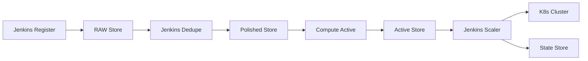
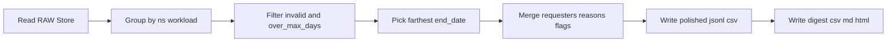
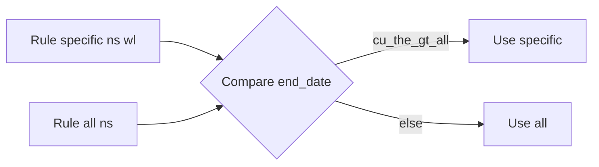
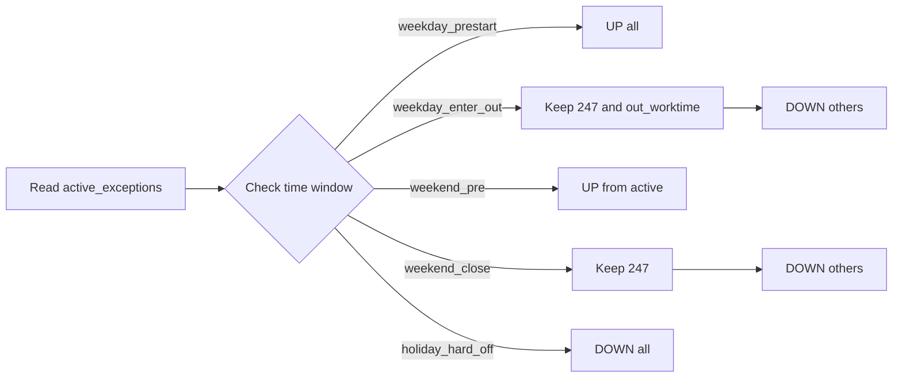
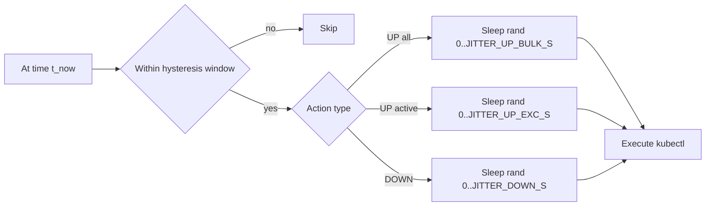
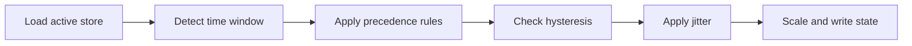
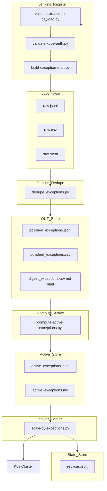

# 1. Tổng quan và Workflow

## 1.1 Mục tiêu

* **Tiết kiệm tài nguyên**: tự động scale xuống ngoài giờ, cuối tuần, ngày lễ.
* **Đảm bảo ngoại lệ**: workload cần chạy 24/7 hoặc ngoài giờ được khai báo giữ nguyên.
* **Quản trị minh bạch**: mọi ngoại lệ bắt buộc có requester, reason, end\_date rõ ràng.
* **An toàn**: hysteresis chống đúp lệnh, jitter phân tán lệnh, rollback từ state.

---

## 1.2 Workflow từ góc nhìn người dùng

### Bước 1 – Đăng ký ngoại lệ

* Người dùng vào **Jenkins job Register**.
* Nhập các thông số:

  * `EXEC_ON_247` hoặc `EXEC_ON_OUT` (chọn ít nhất một).
  * `EXEC_REQUESTER` (người yêu cầu).
  * `EXEC_REASON` (lý do).
  * `EXEC_END_DATE` (≤ 60 ngày).
  * `EXEC_WORKLOAD_LIST` (`namespace | workload`).
  * Upload **kubeconfig** để xác thực quyền.
* **Output**: file RAW (`raw-*.jsonl,csv,meta`) trong thư mục `RAW_ROOT/YYYY-MM-DD/`.

---

### Bước 2 – Gom nhóm ngoại lệ

* **Jenkins job Dedupe** chạy 10 phút/lần.
* Đọc toàn bộ RAW trong khung thời gian LOOKBACK.
* Gom nhóm theo `(namespace, workload)`.
* Giữ record có end\_date xa nhất trong giới hạn.
* Hợp nhất requester và reason.
* **Output**:

  * `polished_exceptions.jsonl` + `.csv`.
  * Digest: `digest_exceptions.csv`, `digest_exceptions.md`, `digest_exceptions.html`.

---

### Bước 3 – Tính ngoại lệ hiệu lực

* **Script Compute Active** lọc polished theo ngày chạy.
* Kết quả là danh sách workload ngoại lệ đang hiệu lực.
* **Output**:

  * `active_exceptions.jsonl`.
  * `active_exceptions.md` (dễ đọc, phục vụ báo cáo).

---

### Bước 4 – Thực hiện scale

* **Jenkins job Scaler** chạy 10 phút/lần.
* Đọc `active_exceptions.jsonl`.
* So với khung giờ:

  * Sáng ngày thường → **UP tất cả**.
  * Tan ca → **giữ ngoại lệ**, DOWN phần còn lại.
  * Cuối tuần → chỉ **UP hoặc giữ ngoại lệ**.
  * Ngày lễ (nếu `HOLIDAY_MODE=hard_off`) → **DOWN tất cả**.
* Có hysteresis ± phút và jitter giây để tránh race.
* **Output**: cập nhật replicas trong cluster, lưu lại `state/replicas.json`.

---

## 1.3 Sơ đồ Mermaid tổng quan

---

## 1.4 Luồng dữ liệu IO

* **RAW Store**: bản ghi ngoại lệ đơn lẻ theo ngày.
* **Polished Store**: dữ liệu đã hợp nhất, có digest cho báo cáo.
* **Active Store**: danh sách ngoại lệ hợp lệ tại thời điểm chạy.
* **State Store**: lưu replicas trước khi DOWN để rollback.

---

# 2. Nguyên lý hoạt động

## 2.1 Các tầng chính

Hệ thống chia thành 4 tầng liên hoàn, phối hợp như một guồng máy:

* **Register**
  Thu nhận yêu cầu ngoại lệ từ Jenkins job. Kiểm tra payload, xác thực quyền kube, sinh dữ liệu RAW.

* **Dedupe**
  Chạy định kỳ, gom dữ liệu RAW theo `(namespace, workload)`. Giữ end\_date xa nhất trong phạm vi cho phép, hợp nhất requester và reason. Xuất polished + digest.

* **Compute Active**
  Lọc polished theo ngày chạy để xác định danh sách workload ngoại lệ đang hiệu lực. Đây là bản đồ tác chiến thực tế tại thời điểm hiện tại.

* **Scaler**
  Đọc active\_exceptions, áp dụng chính sách theo mốc giờ, cuối tuần, holiday. Thực hiện scale bằng kubectl, có hysteresis ± phút và jitter giây để tránh race. Ghi state để rollback.

---

## 2.2 Mối quan hệ giữa các Store

* **RAW Store**: nhật ký gốc từ người dùng.
* **Polished Store**: phiên bản đã xử lý, hợp nhất và sạch sẽ.
* **Active Store**: snapshot đúng ngày, cho Scaler dùng.
* **State Store**: bảo hiểm, giữ replica trước khi DOWN.

---

## 2.3 Cơ chế vận hành tự động

* **Cron lệch pha**: Dedupe (`*/10 * * * *`), Scaler (`H/10 * * * *`) để tránh trùng giờ chạy.
* **Hysteresis**: chỉ kích hoạt action trong cửa sổ ±HYST\_MIN phút quanh mốc giờ, tránh lặp do lệch cron.
* **Jitter**: ngẫu nhiên 0..N giây để phân tán lệnh UP/DOWN, giảm dồn tải.
* **HPA respect**: mặc định giữ minReplicas. Có thể bật force để ép xuống, nhưng chỉ khi có phê duyệt.
* **Rollback**: khi cần, có thể khôi phục replica từ `state/replicas.json`.

---

## 2.4 Chu trình vận hành

1. Người dùng khai báo → tạo RAW.
2. Dedupe hợp nhất → Polished + Digest.
3. Compute Active lọc theo ngày → Active.
4. Scaler hành động theo policy → cập nhật cluster + State.
5. Lặp lại theo cron, đảm bảo hệ thống luôn bám sát giờ làm việc và ngoại lệ đã khai.

---

# 3. Thuật toán Dedupe và Quy tắc Chính sách

## 3.1 Thuật toán Dedupe

**Mục tiêu:** Biến các bản ghi RAW rời rạc thành danh sách ngoại lệ gọn, hợp lệ, không chồng chéo.

**Quy trình:**

1. **Group key** = `namespace | workload`.
2. **Lọc hợp lệ**: `end_date >= hôm_nay` và `end_date <= hôm_nay + MAX_DAYS`.
3. **Chọn bản đại diện**: lấy **end\_date xa nhất** trong nhóm.
4. **Hợp nhất thông tin**:

   * `requesters` = hợp nhất, bỏ trùng.
   * `reasons` = hợp nhất, giữ thứ tự thời gian.
   * `flags` = `on_247` OR `on_out_worktime`.
5. **Ghi polished** và **digest**.

---

## 3.2 Precedence ngoại lệ

**Khoá toàn namespace:** `_ALL_`, `__ALL__`, `ALL`, `*`.

**Nguyên tắc quyết định:**

* Nếu tồn tại **rule cụ thể** và **rule ALL** cho cùng `ns`:

  * Nếu `end_date_cu_the > end_date_all` → **Cụ thể thắng**.
  * Ngược lại hoặc bằng → **ALL thắng**.

---

## 3.3 Quy tắc chính sách Scale

**Khung thời gian Asia Bangkok:**

* **Ngày thường**

  * `weekday_prestart 0710_0805` → **UP tat\_ca** managed namespaces.
  * `weekday_enter_out 1755_1805` → **Giu 247 va out\_worktime** **DOWN con\_lai**.
* **Cuối tuần**

  * `weekend_pre 0845_0905` → **UP theo active**.
  * `weekend_close 1955_2005` → **Chi giu 247** **DOWN con\_lai**.
* **Holiday**

  * Nếu `HOLIDAY_MODE=hard_off` và ngày hiện tại nằm trong `holidays.txt` → **DOWN tat\_ca**.

---

## 3.4 Hysteresis và Jitter

**Hysteresis:** chỉ kích hoạt hành động trong cửa sổ **± HYST\_MIN phút** quanh mốc giờ.

* Ví dụ `HYST_MIN=3`: mốc 0710 hợp lệ trong khoảng **0707 đến 0713**.

**Jitter:** ngẫu nhiên hoá thời điểm bắn lệnh để tránh dồn tải `kubectl`.

* `JITTER_UP_BULK_S`: áp dụng khi **UP tat\_ca** buổi sáng ngày thường.
* `JITTER_UP_EXC_S`: áp dụng khi **UP theo active**.
* `JITTER_DOWN_S`: áp dụng cho mọi **DOWN**.

---

## 3.5 Chuỗi quyết định cuối cùng

1. Đọc **Active Store**.
2. Xác định **time window** hiện tại.
3. Áp dụng **precedence** giữa `specific` và `ALL`.
4. Áp dụng **hysteresis** và **jitter**.
5. Thực thi **scale** và cập nhật **State Store**.

---

# 4. Thành phần hệ thống

## 4.1 Jenkins Pipelines

### Register Pipeline

* **Nhiệm vụ**: Thu nhận yêu cầu ngoại lệ từ người dùng.
* **Stage chính**:

  1. **Validate Payload** → gọi `validate-exception-payload.py`.
  2. **Check Auth** → gọi `validate-kube-auth.py` với kubeconfig user upload.
  3. **Build Draft** → gọi `build-exception-draft.py` để sinh record.
* **Output**: `raw-<job>-<build>.jsonl,csv,meta` dưới `RAW_ROOT/YYYY-MM-DD/`.

---

### Dedupe Pipeline

* **Nhiệm vụ**: Gom và chuẩn hóa dữ liệu RAW.
* **Stage chính**:

  1. **Read RAW** → quét RAW trong `LOOKBACK_DAYS`.
  2. **Run dedupe\_exceptions.py** → gom theo `(ns, workload)`, chọn end\_date xa nhất, hợp nhất requester & reason.
  3. **Export** → ghi polished và digest.
* **Output**: `polished_exceptions.jsonl`, `.csv`, digest (`.csv`, `.md`, `.html`).

---

### Scaler Pipeline

* **Nhiệm vụ**: Scale workload theo chính sách.
* **Stage chính**:

  1. **Load active\_exceptions.jsonl**.
  2. **Compute time window** → policy prestart, enter\_out, weekend, holiday.
  3. **Run scale-by-exceptions.py** → áp precedence, hysteresis, jitter.
  4. **Update cluster** → patch replicas.
  5. **Save state** → ghi `state/replicas.json`.
* **Output**: workload trong cluster được scale đúng chính sách.

---

## 4.2 Scripts Python

| Script                            | Chức năng                                                               |
| --------------------------------- | ----------------------------------------------------------------------- |
| **build-exception-draft.py**      | Sinh record từ Jenkins param, ghi RAW, dọn retention                    |
| **validate-exception-payload.py** | Kiểm tra input, bắt buộc requester, reason, end\_date, workload list    |
| **validate-kube-auth.py**         | Test quyền kubeconfig, đảm bảo có thể patch scale                       |
| **dedupe\_exceptions.py**         | Gom nhóm RAW, chọn end\_date xa nhất, hợp nhất requester/reason         |
| **compute-active-exceptions.py**  | Lọc polished theo ngày chạy, xuất active\_exceptions                    |
| **scale-by-exceptions.py**        | Quyết định scale theo policy, precedence, hysteresis, jitter; lưu state |

---

## 4.3 Workflow kết nối giữa các thành phần

---

## 4.4 Ý nghĩa kết nối

* **Register**: validate input → check quyền → build draft → ghi RAW.
* **Dedupe**: đọc RAW → dedupe\_exceptions.py → polished + digest.
* **Compute Active**: đọc polished → lọc → active\_exceptions.
* **Scaler**: đọc active → scale-by-exceptions.py → patch cluster → lưu state.