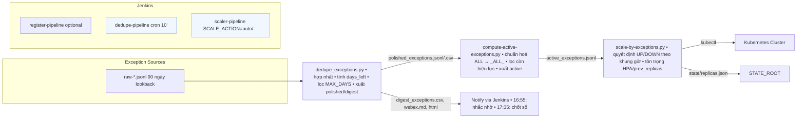
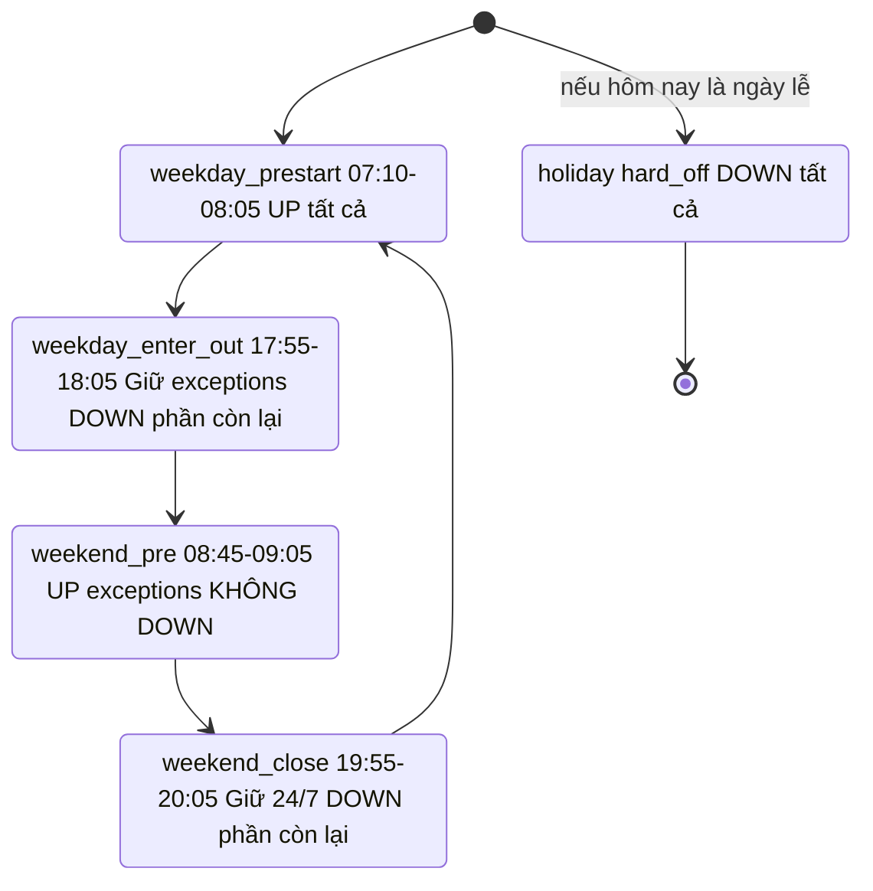
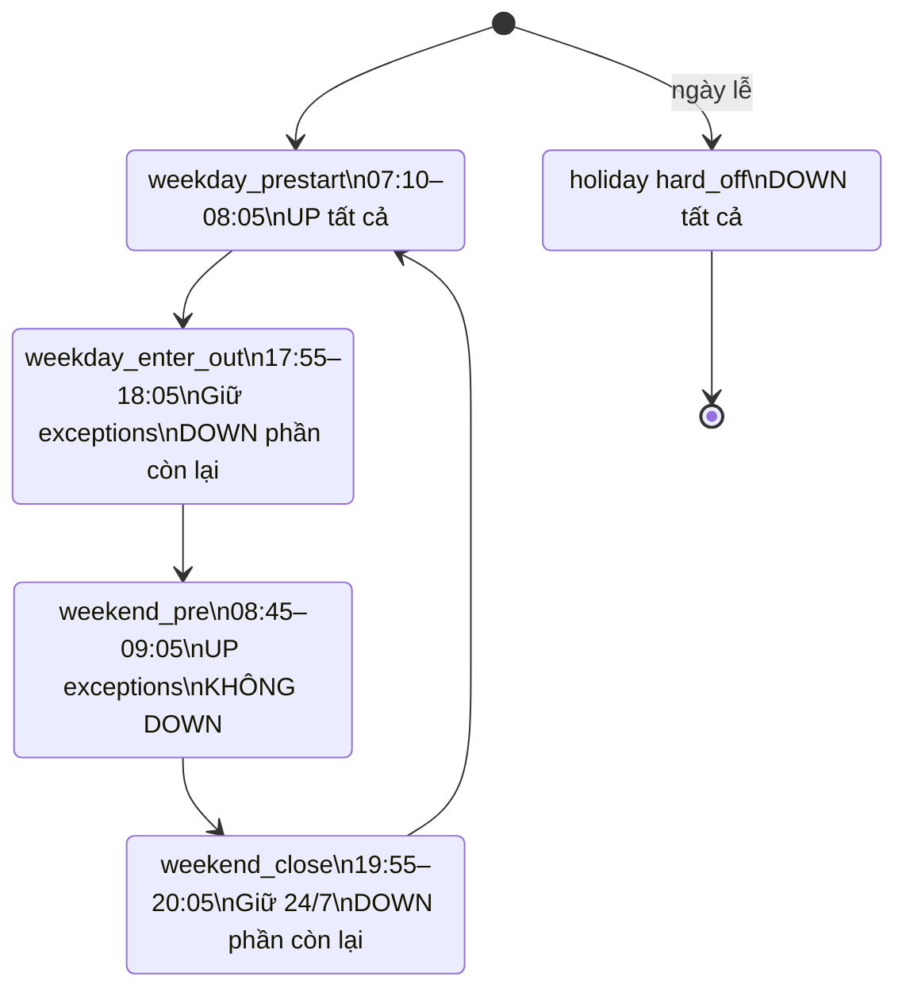

# Phần 1 — Tổng quan giải pháp (Executive & Ops overview)

## 1.1. Mục tiêu

* **Tắt** (scale to 0) các workload **ngoài giờ** và cuối tuần, đồng thời **giữ/khởi động** những workload **được đăng ký ngoại lệ**.
* Chuẩn hoá quy trình **đăng ký – xét duyệt – công bố – thực thi** ngoại lệ, có **nhật ký** và **thông báo** rõ ràng.
* Đảm bảo an toàn vận hành: **không “phang 0” nhầm**, tôn trọng **HPA minReplicas**, có cơ chế **khôi phục**.

## 1.2. Phạm vi

* Cụm Kubernetes (nhiều namespace), với **danh sách namespace được quản lý** (`managed-ns.txt`) và **danh sách loại trừ** (`deny-ns.txt`).
* Workloads: `Deployment` & `StatefulSet`.
* Luồng dữ liệu ngoại lệ: từ **raw** → `dedupe` → **polished** → `compute-active` → **active** → `scaler`.

## 1.3. Thành phần & Vai trò

* **Dedupe** (`dedupe_exceptions.py`): gom dữ liệu thô 90 ngày, loại bản ghi lỗi, hợp nhất theo cặp `(ns, workload)`, tính `days_left`, xuất:

  * Máy đọc: `polished_exceptions.jsonl/.csv`
  * Người đọc: `digest_exceptions.csv`, `digest_exceptions.webex.md`, `digest_exceptions.html` (có **Reason(s)** và **Tag ⚠️ ≤ 3 ngày**)
* **Compute-active** (`compute-active-exceptions.py`): lọc theo `MAX_DAYS` (mặc định 60), chuẩn hoá **ALL → `_ALL_`**, xuất **`active_exceptions.jsonl`** + bảng **`active_exceptions.md`**.
* **Scaler** (`scale-by-exceptions.py`): đọc active, quyết định UP/DOWN theo khung giờ & holiday, tôn trọng **HPA** & **prev\_replicas**, lưu `state/replicas.json`.
* **Jenkins Pipelines**:

  * `register` (đăng ký ngoại lệ, kiểm tra payload)
  * `dedupe` (chạy 10’/lần, tạo digest)
  * `scaler` (theo cron/trigger, `SCALE_ACTION` hoặc `auto`)
* **Cấu hình lịch/holiday**: `holidays.txt` (`HOLIDAY_MODE=hard_off`: down tất cả vào ngày lễ).

## 1.4. Lịch vận hành (Asia/Bangkok)

* **Ngày thường**

  * `weekday_prestart` (07:10–08:05): **UP tất cả** workloads (bulk warm-up).
  * `weekday_enter_out` (17:55–18:05): **chỉ giữ exceptions (247 + ngoài giờ)**, **DOWN phần còn lại**.
* **Cuối tuần**

  * `weekend_pre` (08:45–09:05): **chỉ UP exceptions**, **không DOWN** workload khác (chế độ an toàn).
  * `weekend_close` (19:55–20:05): **chỉ giữ 24/7**, **DOWN** phần còn lại.
* **Holiday (`hard_off`)**: **DOWN tất cả** (bỏ qua NOOP/khung giờ).

## 1.5. Quy ước & Chính sách

* **Sentinel ALL chuẩn**: **`_ALL_`** (đại diện “toàn bộ workloads trong namespace”).

  * Input có thể dùng alias (`__ALL__`, `all`, `*`, …) → pipeline **chuẩn hoá** về `_ALL_`.
  * Scaler nhận diện **cả `_ALL_` và `__ALL__`** (tương thích ngược).
* **Giới hạn thời hạn**: `MAX_DAYS=60` (có thể chỉnh); bản ghi quá hạn tự loại khỏi active.
* **Thông báo**: dùng các file digest (`.webex.md`, `.html`) — có **Tag ⚠️** cho dòng sắp hết hạn. (Jenkins stage gửi 2 lần/ngày: **lần 1 nhắc nhở**, **lần 2 chốt sổ**).

## 1.6. Lợi ích

* Tiết kiệm chi phí (DOWN có kiểm soát) & trải nghiệm ổn định (UP đúng cái cần).
* Minh bạch (digest/active rõ ràng), dễ kiểm toán (log & state giữ lại).
* Giảm rủi ro thao tác thủ công, có **fallback** nhờ `prev_replicas` + HPA.

---

# 2) Kiến trúc & luồng xử lý

## 2.1. Sơ đồ tổng thể



## 2.2. Thành phần & trách nhiệm

- **dedupe_exceptions.py**
    - Quét `RAW_ROOT` (90 ngày), parse + gom nhóm theo `(ns, workload)`.
    - Chọn `end_date` ưu tiên gần/đúng cửa sổ (`0..MAX_DAYS`, mặc định 60).
    - Tính `days_left`; hợp nhất `requesters/reasons/patchers`.
    - **Output:**
        - Máy đọc: `polished_exceptions.jsonl/.csv`, `invalid.jsonl`.
        - Người đọc: `digest_exceptions.csv`, `digest_exceptions.webex.md`, `digest_exceptions.html` (có **Reason(s)** + **Tag ⚠️** ≤ 3 ngày; HTML highlight).
        
- **compute-active-exceptions.py**
    - Lọc polished theo `MAX_DAYS`, chuẩn hoá **ALL → `_ALL_`** (nhận nhiều alias).
    - **Output:** `active_exceptions.jsonl` (máy), `active_exceptions.md` (người).
        
- **scale-by-exceptions.py**
    - Định tuyến theo `SCALE_ACTION` (hoặc `auto` dựa trên giờ Asia/Bangkok + hysteresis).
    - Tính `want_up` từng workload từ **active** (ưu tiên **cụ thể > _ALL_** theo `end_date`).
    - Khi UP: ưu tiên `HPA.minReplicas` > `prev_replicas` > `DEFAULT_UP`.
    - Khi DOWN: lưu `prev_replicas` vào `STATE_ROOT`.
    - **Guard an toàn:** `weekend_pre` **không DOWN** workload không-ngoại-lệ.
        
- **Jenkins**
    - `dedupe`: chạy 10’/lần, sinh digest để notify.
    - `scaler`: `SCALE_ACTION=auto` (hoặc chọn tay), áp vào cluster.
    - `register` (tuỳ chọn): validate đăng ký ngoại lệ đầu vào.
        

## 2.3. Luồng thời gian (state machine rút gọn)



## 2.4. Dữ liệu, chuẩn hoá & ưu tiên
- **Sentinel ALL chuẩn:** `_ALL_` (đại diện toàn bộ workload trong namespace).
    - Input có thể là `__ALL__`, `all`, `ALL`, `*`, `ALL-OF-WORKLOAD(S)`… → **compute-active** chuẩn hoá về `_ALL_`.
    - **Scaler** tra **cả `_ALL_` và `__ALL__`** (tương thích ngược).
        
- **Ưu tiên (precedence) khi vừa có cụ thể vừa có ALL:**
    - So sánh `end_date_specific` và `end_date_all`: **cụ thể thắng nếu muộn hơn** (chạy lâu hơn).
    - Nếu một bên thiếu `end_date`: bên **có** `end_date` thắng.
    - Nếu cả hai thiếu: chọn **ALL** (an toàn).
        
- **Cửa sổ hiệu lực:** chỉ nhận bản ghi có `0 ≤ days_left ≤ MAX_DAYS` (mặc định 60). Ngoài cửa sổ → **invalid**.
    
## 2.5. Quy tắc UP/DOWN
- **weekday_prestart (sáng ngày thường)**
    - UP **tất cả** workloads trong `managed-ns`.
        
- **weekday_enter_out (18:00 ngày thường)**
    - UP **exceptions** (`247` & `out_worktime`), DOWN phần còn lại.
        
- **weekend_pre (09:00 cuối tuần) — an toàn**
    - UP **exceptions**; **không DOWN** workload khác (tránh flap & cho phép đăng ký bổ sung sau nhắc nhở).
        
- **weekend_close (20:00 cuối tuần)**
    - Giữ **24/7**, DOWN phần còn lại.
        
- **holiday (hard_off)**
    - DOWN tất cả trong `managed-ns` (bỏ qua NOOP).
        

## 2.6. Cơ chế kỹ thuật quan trọng
- **HPA-aware UP:** nếu có HPA → dùng `minReplicas` làm sàn (≥1). Nếu không HPA → thử `prev_replicas` (nếu có), ngược lại dùng `DEFAULT_UP` (mặc định 1).
- **Lưu/khôi phục trạng thái:** `state/replicas.json` ghi `prev_replicas` khi DOWN, dùng lại khi UP.
- **Jitter** (ngẫu nhiên trễ):
    - Bulk UP (`weekday_prestart`): `0..JITTER_UP_BULK_S` (mặc định 15s)
    - UP theo exception (`weekend_pre`, `weekday_enter_out`, `weekend_close`): `0..JITTER_UP_EXC_S` (mặc định 5s)
    - DOWN: `0..JITTER_DOWN_S` (mặc định 2s)
        
- **Hysteresis thời gian (`HYST_MIN`)**: cho phép ± vài phút quanh mốc giờ để tránh dính mép.
- **MAX_ACTIONS_PER_RUN**: giới hạn số thao tác mỗi tick (giảm burst).
    

## 2.7. Tệp & thư mục chuẩn

```
/data/exceptions/
├── raw/                         # nguồn thô (jsonl)
├── out/
│   ├── polished_exceptions.jsonl / .csv
│   ├── invalid.jsonl
│   ├── digest_exceptions.csv
│   ├── digest_exceptions.webex.md
│   ├── digest_exceptions.html
│   ├── active_exceptions.jsonl
│   └── active_exceptions.md
└── state/
    └── replicas.json            # lưu prev_replicas
```

## 2.8. Lỗi, bảo toàn & khôi phục
- **Bảo toàn:**
    - Không có `active_exceptions.jsonl` → scaler **NOOP/guard** (không down bừa).
    - `weekend_pre` chặn DOWN (an toàn).
        
- **Khôi phục:**
    - Khi DOWN, luôn lưu `prev_replicas`; khi UP, ưu tiên khôi phục từ đây (hoặc HPA min).
        
- **Chẩn đoán nhanh:**
    - So `active_exceptions.md` với lệnh `kubectl get deploy,statefulset -n <ns>` để dò khác biệt.
    - Bật `DRY_RUN=1` trước khi áp patch lớn.
        

---

# 3) Đặc tả kỹ thuật

## 3.1. Định nghĩa ngoại lệ (Exception Annotations)

Mỗi workload (Deployment/StatefulSet) được phép đăng ký ngoại lệ qua payload YAML/CSV (đăng ký → raw). Trường chính:

| Trường                     | Bắt buộc | Mô tả                                                                          |
| -------------------------- | -------- | ------------------------------------------------------------------------------ |
| `ns`                       | ✅        | Namespace                                                                      |
| `workload`                 | ✅        | Tên workload, hoặc `_ALL_` (đại diện toàn bộ namespace)                        |
| `on-exeption-247`          | tuỳ chọn | `true/false` – bật 24/7                                                        |
| `on-exeption-out-worktime` | tuỳ chọn | `true/false` – bật ngoài giờ (Mon–Fri 18:00–22:00, Sat–Sun 09:00–20:00)        |
| `on-exeption-requester`    | ✅        | Người yêu cầu (một hoặc nhiều, cách nhau bởi `,`)                              |
| `on-exeption-reason`       | ✅        | Lý do chính đáng                                                               |
| `on-exeption-endtime`      | ✅        | Hạn cuối hiệu lực (YYYY-MM-DD hoặc YYYYMMDD, ≤60 ngày tính từ hôm chạy dedupe) |
| `created_by`               | auto     | Người patch payload vào cluster                                                |
| `created_at`               | auto     | Thời điểm tạo bản ghi                                                          |

---

## 3.2. Các file đầu ra / đầu vào

### Raw (nguồn thô)

* `raw-*.jsonl` (tạo từ Jenkins job per-team).
* Giữ nguyên bản ghi, lưu tại `/data/exceptions/raw/YYYY-MM-DD/`.

### Polished (sau dedupe)

* `polished_exceptions.jsonl/.csv` – máy đọc, chuẩn format.
* `invalid.jsonl` – bản ghi lỗi (thiếu field, quá hạn…).
* Digest người đọc:

  * `digest_exceptions.csv`
  * `digest_exceptions.webex.md` (bảng Markdown, highlight ⚠️ ≤3 ngày)
  * `digest_exceptions.html` (bảng HTML cho email)

### Active (sau compute-active)

* `active_exceptions.jsonl` – chính thức cho scaler.
* `active_exceptions.md` – để dev/ops dễ kiểm tra.

### State (khi scaler chạy)

* `state/replicas.json` – lưu `prev_replicas`, `last_up`, `last_down`.

---

## 3.3. Thuật toán Dedupe

Pseudo-code rút gọn:

```
for each ns, workload group:
    modes = union of all modes seen (247, out_worktime)
    requesters = merge unique
    reasons = merge unique
    patchers = merge unique
    end_date = max(end_date) trong cửa sổ (0..MAX_DAYS)
    if both specific and ALL:
        - chọn bản có end_date muộn hơn
        - nếu equal, chọn ALL
```

⚠️ Lưu ý: sentinel ALL canonical là `_ALL_`, nhưng scaler chấp nhận `_ALL_` và `__ALL__`.

---

## 3.4. Thuật toán Scaler

4 action + holiday:

* **weekday\_prestart**: UP tất cả workloads.
* **weekday\_enter\_out**: giữ (UP) exceptions (`247`/`out_worktime`), DOWN phần còn lại.
* **weekend\_pre**: UP exceptions, **không DOWN** phần còn lại.
* **weekend\_close**: giữ 24/7, DOWN phần còn lại.
* **holiday (hard\_off)**: DOWN tất cả workloads trong `managed-ns`.

### Quy tắc UP

```
if workload.cur == 0 and want_up == True:
    if HPA.minReplicas exists:
        target = max(1, HPA.minReplicas)
    elif prev_replicas exists:
        target = prev_replicas
    else:
        target = DEFAULT_UP
```

### Quy tắc DOWN

```
if want_up == False:
    if act == weekend_pre:
        skip (no down)
    else:
        save prev_replicas
        scale_to TARGET_DOWN (default 0)
```

---

## 3.5. Biến môi trường chính

| Biến                | Mặc định                 | Mô tả                                                                                           |
| ------------------- | ------------------------ | ----------------------------------------------------------------------------------------------- |
| `RAW_ROOT`          | `/data/exceptions/raw`   | thư mục raw                                                                                     |
| `OUT_DIR`           | `/data/exceptions/out`   | thư mục polished/digest/active                                                                  |
| `STATE_ROOT`        | `/data/exceptions/state` | lưu replicas.json                                                                               |
| `LOOKBACK_DAYS`     | 90                       | raw file retention                                                                              |
| `MAX_DAYS`          | 60                       | giới hạn max days\_left                                                                         |
| `ACTION`            | `auto`                   | scaler action (`weekday_prestart`, `weekday_enter_out`, `weekend_pre`, `weekend_close`, `noop`) |
| `DEFAULT_UP`        | 1                        | số replicas mặc định khi UP                                                                     |
| `TARGET_DOWN`       | 0                        | replicas khi DOWN                                                                               |
| `DOWN_HPA_HANDLING` | `skip`                   | skip/force khi DOWN workload có HPA                                                             |
| `JITTER_UP_BULK_S`  | 15                       | jitter khi bulk UP                                                                              |
| `JITTER_UP_EXC_S`   | 5                        | jitter khi UP theo exception                                                                    |
| `JITTER_DOWN_S`     | 2                        | jitter khi DOWN                                                                                 |
| `HYST_MIN`          | 3                        | phút hysteresis quanh mốc giờ                                                                   |
| `KUBECONFIG_FILE`   | n/a                      | path kubeconfig                                                                                 |
| `MANAGED_NS_FILE`   | `managed-ns.txt`         | regex namespace được quản lý                                                                    |
| `DENY_NS_FILE`      | `deny-ns.txt`            | regex loại trừ                                                                                  |
| `HOLIDAYS_FILE`     | `holidays.txt`           | danh sách ngày lễ                                                                               |
| `HOLIDAY_MODE`      | `hard_off`               | down tất cả trong holiday                                                                       |


---

# 4) Chính sách & Quy định

## 4.1. Phạm vi áp dụng

* Áp dụng cho tất cả **namespace** nằm trong danh sách `managed-ns.txt`.
* Không áp dụng cho namespace nằm trong `deny-ns.txt`.
* Chỉ quản lý workload dạng **Deployment** và **StatefulSet**.

---

## 4.2. Quy định cho Team Dev (người đăng ký ngoại lệ)

1. **Bắt buộc phải đăng ký ngoại lệ** nếu workload cần chạy ngoài khung business hours (Mon–Fri 08:00–18:00).

   * Nếu không đăng ký → workload sẽ **tự động bị scale to 0** theo lịch.

2. **Thông tin bắt buộc khi đăng ký ngoại lệ**:

   * `requester`: người yêu cầu (ít nhất 1).
   * `reason`: lý do chính đáng.
   * `endtime`: hạn cuối (≤ 60 ngày tính từ ngày đăng ký).

3. **Hình thức ngoại lệ**:

   * `247` (24/7) → workload chạy liên tục.
   * `out_worktime` → workload chỉ bật ngoài giờ + cuối tuần.

4. **Giới hạn**:

   * Một ngoại lệ tối đa 60 ngày.
   * Nếu cần gia hạn → phải đăng ký lại trước khi hết hạn.
   * Hệ thống sẽ highlight ⚠️ các ngoại lệ còn ≤ 3 ngày trong digest thông báo.

5. **Sentinel ALL**:

   * Nếu muốn giữ toàn bộ workload trong namespace → dùng `_ALL_`.
   * Không dùng alias khác (hệ thống vẫn nhận `__ALL__`, `*`, … nhưng `_ALL_` là chuẩn chính thức).

6. **Trách nhiệm**:

   * Đội dev phải tự rà soát digest hàng ngày.
   * Nếu workload bị scale 0 ngoài ý muốn → kiểm tra digest + active trước khi khiếu nại.

---

## 4.3. Quy định vận hành cho Team Ops

1. **Pipeline Jenkins**:

   * `dedupe` chạy 10 phút/lần, xuất digest và publish cho thông báo.
   * `scaler` chạy theo cron, `SCALE_ACTION=auto` (quyết định dựa trên giờ Asia/Bangkok).

2. **Thông báo**:

   * Hệ thống gửi digest 2 lần/ngày:

     * **16:55** → thông báo lần 1 (để team bổ sung đăng ký).
     * **17:35** → thông báo lần 2 (chốt sổ, áp dụng từ 18:00).
   * Digest gồm: namespace, workload, mode, end\_date, days\_left, requester(s), reason(s), patcher(s).

3. **Holiday**:

   * Danh sách ngày lễ được định nghĩa trong `holidays.txt`.
   * Nếu `HOLIDAY_MODE=hard_off` → toàn bộ workload trong `managed-ns` sẽ bị scale 0 bất kể ngoại lệ.

4. **Override thủ công**:

   * Ops có thể chạy scaler thủ công với `SCALE_ACTION` = `weekday_prestart`, `weekday_enter_out`, `weekend_pre`, `weekend_close`.
   * Bắt buộc bật `DRY_RUN=1` trước khi chạy thủ công ngoài khung giờ.

5. **Quy định HPA**:

   * Khi UP, scaler luôn tôn trọng `minReplicas` của HPA.
   * Khi DOWN, nếu workload có HPA → hành vi phụ thuộc `DOWN_HPA_HANDLING` (mặc định `skip`).

---

## 4.4. Quy định về dữ liệu & retention

* **Retention raw**: giữ 90 ngày file `raw-*.jsonl`.
* **Retention polished/digest/active**: giữ 60 ngày.
* **State file (`replicas.json`)**: không xóa, luôn lưu để khôi phục.
* **Invalid.jsonl**: giữ 30 ngày để phục vụ điều tra lỗi.

---

## 4.5. Quy định an toàn

1. **Không scale bừa**:

   * Nếu thiếu file `active_exceptions.jsonl` → scaler tự động **NOOP**.
   * Nếu có lỗi parse/lock → job exit 0, không động vào workload.

2. **An toàn weekend\_pre**:

   * Chỉ UP exceptions, không DOWN workload khác.
   * DOWN thực sự chỉ diễn ra ở `weekday_enter_out` và `weekend_close`.

3. **Cơ chế phục hồi**:

   * Khi DOWN, scaler luôn lưu `prev_replicas`.
   * Khi UP, scaler khôi phục từ `prev_replicas` (nếu có), hoặc dùng `HPA.minReplicas`, hoặc `DEFAULT_UP`.

---

# 5) Hướng dẫn sử dụng cho Team Dev

## 5.1. Khi nào cần đăng ký ngoại lệ?

* Workload cần chạy **ngoài giờ hành chính** (Mon–Fri 18:00–22:00, Sat–Sun 09:00–20:00).
* Workload cần chạy **24/7 liên tục**.
* Trường hợp workload phục vụ **test khẩn, demo, hoặc dịch vụ phụ trợ** cần bật ngoài lịch chuẩn.

Nếu không đăng ký → workload sẽ bị **scale to 0** theo lịch auto-scaler.

---

## 5.2. Cách đăng ký ngoại lệ

### a) Payload YAML mẫu

```yaml
annotations:
  on-exeption-247: false
  on-exeption-out-worktime: true
  on-exeption-requester: 'PM someone'
  on-exeption-reason: 'test ebank'
  on-exeption-endtime: 2025-09-23

workload-list: |-
  sb-vhht-dev | workloadA
  sb-vhht-test | workloadB
  sb-vhht-test | workloadC

```
📌 Ý nghĩa:
* Toàn bộ workload trong workload-list sẽ áp dụng chung annotations ở trên.
* Mỗi dòng namespace | workload là một bản ghi.
### b) Payload YAML với sentinel `_ALL_`

```yaml
annotations:
  on-exeption-247: true
  on-exeption-out-worktime: false
  on-exeption-requester: 'trung.md'
  on-exeption-reason: 'Cần giữ nguyên toàn bộ dịch vụ'
  on-exeption-endtime: 2025-10-15

workload-list: |-
  sb-itom-aiom | all-of-workloads
  sb-itom-op   | all-of-workloads

```
📌 Ý nghĩa:
* Với namespace sb-itom-aiom và sb-itom-op, tất cả workload trong ns đó sẽ được coi là ngoại lệ (24/7).
* Trong bước compute-active, all-of-workloads sẽ được chuẩn hoá thành _ALL_ (chuẩn canonical).
### c) Payload CSV mẫu

```csv
ns,workload,on-exeption-247,on-exeption-out-worktime,on-exeption-requester,on-exeption-reason,on-exeption-endtime
sb-backendapi-dev,authen-api-dev-main,false,true,anh.vtq,"Cần test regression ngoài giờ",2025-10-30
sb-itom-aiom,all-of-workloads,true,false,trung.md,"Bảo trì định kỳ, cần chạy 24/7",2025-11-05
```

---

## 5.3. Quy tắc quan trọng

* **Endtime** tối đa **60 ngày** kể từ ngày đăng ký.
* **Requester** và **Reason** là bắt buộc.
* **Sentinel ALL**: dùng `_ALL_` (chuẩn chính thức).
* Nếu workload cụ thể và `_ALL_` cùng tồn tại → workload cụ thể **ưu tiên** nếu có endtime muộn hơn.

---

## 5.4. Cách kiểm tra ngoại lệ của mình

1. Kiểm tra digest hàng ngày (Webex/email) – gửi vào **16:55** và **17:35**.
2. Tìm dòng namespace + workload của mình.
3. Nếu thấy ⚠️ (còn ≤ 3 ngày) → phải đăng ký gia hạn.

---

## 5.5. Ví dụ digest (Markdown/Webex)

```markdown
| NS | Workload | Mode | End | D-left | Requester(s) | Reason(s) | Patcher(s) |
| --- | --- | --- | --- | ---: | --- | --- | --- |
| sb-backendapi-dev | authen-api-dev-main | Ngoài giờ | 2025-10-30 | 54 | anh.vtq | Cần test regression ngoài giờ | tung.ns5 |
| sb-itom-aiom | all-of-workloads | 24/7 | 2025-11-05 | 60 | trung.md | Bảo trì định kỳ, cần chạy 24/7 | tung.ns5 |
| sb-backendapi-dev | cust-info-redis-dev-main | 24/7 | 2025-11-04 | 59 | thao.nv, lam.ct | Dependency service, phải chạy liên tục | tung.ns5 |
```

⚠️ Các bản ghi gần hết hạn (≤ 3 ngày) sẽ có tag ⚠️ để owner tự xử lý.

---

## 5.6. FAQ

**Q: Workload của tôi bị scale 0 ngoài ý muốn, xử lý thế nào?**
A: Kiểm tra digest/active exceptions. Nếu workload không có ngoại lệ → cần đăng ký lại. Nếu đã đăng ký nhưng hết hạn → gia hạn endtime.

**Q: Tôi muốn giữ toàn bộ namespace chạy 24/7, làm thế nào?**
A: Dùng sentinel `all-of-workloads` trong trường `workload`, set `on-exeption-247: true`.

**Q: Tôi có thể đăng ký vừa 24/7 vừa ngoài giờ không?**
A: Không. Chỉ chọn một trong hai: `247` hoặc `out_worktime`.

**Q: Endtime tối đa là bao lâu?**
A: 60 ngày. Sau đó phải đăng ký lại.

**Q: Nếu đăng ký ngoại lệ vào lúc 17:20 thì có hiệu lực ngay không?**
A: Có. Digest 17:35 sẽ chốt sổ lại, scaler 18:00 sẽ áp dụng bản cập nhật.

---

# 6) Hướng dẫn vận hành cho Team Ops

## 6.1. Jenkins Pipelines

### a) `register` (optional)

* Mục tiêu: nhập payload ngoại lệ từ team Dev.
* Các bước:

  1. Kiểm tra định dạng với `validate-exception-payload.py`.
  2. Kiểm tra kube context với `validate-kube-auth.py`.
  3. Xuất file raw-\*.jsonl vào `RAW_ROOT/YYYY-MM-DD/`.
* Lưu ý: chạy **per-team job** với credentials riêng, không upload file thủ công.

### b) `dedupe`

* Cron: mỗi 10 phút.
* Thực thi `dedupe_exceptions.py` → sinh `polished_exceptions.*` + digest (csv/webex/html).
* Sau đó publish digest:

  * 16:55: thông báo lần 1 (cảnh báo).
  * 17:35: thông báo lần 2 (chốt sổ).
* Đầu ra: `/data/exceptions/out/`.

### c) `scaler`

* Cron: 07:10, 17:55 (weekday); 08:45, 19:55 (weekend).
* Thực thi `scale-by-exceptions.py` với `ACTION=auto`.
* Có thể override bằng tham số Jenkins:

  ```groovy
  parameters {
    choice(
      choices: ['auto', 'weekday_prestart', 'weekday_enter_out', 'weekend_pre', 'weekend_close'],
      name: 'SCALE_ACTION',
      description: 'Chọn hành động scaler...'
    )
  }
  ```

---

## 6.2. Biến môi trường & config

* `MANAGED_NS_FILE`: danh sách regex namespace quản lý.
* `DENY_NS_FILE`: danh sách regex namespace loại trừ.
* `HOLIDAYS_FILE`: danh sách ngày lễ (YYYY-MM-DD).
* `HOLIDAY_MODE=hard_off`: toàn bộ workload bị scale 0 khi trúng ngày lễ.
* `STATE_ROOT`: chứa `replicas.json` (lưu `prev_replicas`).

---

## 6.3. Chạy thủ công

* **Dry-run** (không scale thật):

  ```bash
  DRY_RUN=1 ACTION=weekday_enter_out ./scale-by-exceptions.py
  ```
* **Thực thi thật**:

  ```bash
  ACTION=weekend_close ./scale-by-exceptions.py
  ```

---

## 6.4. Kiểm tra kết quả

* So sánh digest/active với cluster:

  ```bash
  kubectl -n sb-backendapi-dev get deploy,statefulset
  cat /data/exceptions/out/active_exceptions.md
  ```
* Nếu workload có trong `active_exceptions` mà vẫn bị scale 0 → check log scaler + `replicas.json`.

---

## 6.5. Xử lý sự cố

* **State file kẹt**: xoá lock file trong `OUT_DIR/.lock`.
* **replicas.json lỗi**: xoá hoặc sửa tay → scaler sẽ fallback `DEFAULT_UP` hoặc `HPA.minReplicas`.
* **Digest không cập nhật**: kiểm tra cron job `dedupe` và quyền ghi `/data/exceptions/out/`.
* **Holiday nhầm**: xoá hoặc comment dòng trong `holidays.txt`.

---

## 6.6. Best practices cho Ops

* Luôn bật `DRY_RUN=1` khi chạy thủ công ngoài khung giờ.
* Rà digest lúc 16:55 & 17:35 để chắc chắn exceptions hợp lệ.
* Nếu có thay đổi lớn (nhiều workloads), giới hạn `MAX_ACTIONS_PER_RUN` để giảm burst scale.
* Giữ `DEBUG=1` trong môi trường staging để xem log chi tiết.

---
Rõ lệnh Soái 🚩. Ta hoàn tất bộ tài liệu với **Phần 7: Phụ lục** – nơi chứa “bản đồ, biểu mẫu và ví dụ thực tế” để sếp xem là hiểu, dev/ops đọc là làm được ngay.

---

# 7) Phụ lục

## 7.1. Lịch trình auto-scaler (Asia/Bangkok)



---

## 7.2. Mẫu exception payload (Dev submit)

### a) Workload cụ thể

```yaml
annotations:
  on-exeption-247: false
  on-exeption-out-worktime: true
  on-exeption-requester: 'PM someone'
  on-exeption-reason: 'test ebank'
  on-exeption-endtime: 2025-09-23

workload-list: |-
  sb-vhht-dev | workloadA
  sb-vhht-test | workloadB
  sb-vhht-test | workloadC
```

### b) Toàn bộ namespace

```yaml
annotations:
  on-exeption-247: true
  on-exeption-out-worktime: false
  on-exeption-requester: 'trung.md'
  on-exeption-reason: 'Bảo trì định kỳ, cần chạy 24/7'
  on-exeption-endtime: 2025-10-15

workload-list: |-
  sb-itom-aiom | all-of-workloads
  sb-itom-op   | all-of-workloads
```

---

## 7.3. Ví dụ digest (Webex/Markdown)

```markdown
| NS | Workload | Mode | End | D-left | Requester(s) | Reason(s) | Patcher(s) |
| --- | --- | --- | --- | ---: | --- | --- | --- |
| sb-backendapi-dev | authen-api-dev-main | Ngoài giờ | 2025-10-30 | 54 | anh.vtq | Cần test regression ngoài giờ | tung.ns5 |
| sb-itom-aiom | _ALL_ | 24/7 | 2025-11-05 | 60 | trung.md | Bảo trì định kỳ, cần chạy 24/7 | tung.ns5 |
| sb-backendapi-dev | cust-info-redis-dev-main | 24/7 | 2025-11-04 | 59 | thao.nv, lam.ct | Dependency service, phải chạy liên tục | tung.ns5 |
```

---

## 7.4. Ví dụ active\_exceptions.md

```markdown
**Active exceptions @ 2025-09-06**

| NS | Workload | Mode | End | D-left |
| --- | --- | --- | --- | ---: |
| sb-backendapi-dev | authen-api-dev-main | Ngoài giờ | 2025-10-30 | 54 |
| sb-backendapi-dev | cust-info-redis-dev-main | 24/7 | 2025-11-04 | 59 |
| sb-itom-aiom | _ALL_ | 24/7 | 2025-11-05 | 60 |
```

---

## 7.5. Mẫu Jenkinsfile – scaler pipeline

```groovy
pipeline {
  agent any
  parameters {
    choice(
      choices: ['auto', 'weekday_prestart', 'weekday_enter_out', 'weekend_pre', 'weekend_close'],
      name: 'SCALE_ACTION',
      description: '''\
Chọn hành động scaler:
- auto              → Tự động xác định theo giờ VN
- weekday_prestart  → 07:10–08:05 ngày thường: bật toàn bộ
- weekday_enter_out → 17:55–18:05 ngày thường: giữ exceptions, down phần còn lại
- weekend_pre       → 08:45–09:05 cuối tuần: bật exceptions, không down workload khác
- weekend_close     → 19:55–20:05 cuối tuần: giữ 24/7, down phần còn lại'''
    )
  }
  stages {
    stage('Scale workloads') {
      steps {
        sh """
          ACTION=${params.SCALE_ACTION} \
          /data/exceptions/scripts/scale-by-exceptions.py
        """
      }
    }
  }
}
```

---

## 7.6. Mẫu file cấu hình

### `managed-ns.txt`

```text
^sb-backendapi-dev$
^sb-itom-.*$
^sb-vhht-(dev|test)$
```

### `deny-ns.txt`

```text
^kube-.*$
^monitoring$
```

### `holidays.txt`

```text
2025-12-25
2026-01-01
```

---

## 7.7. Lưu ý kiểm thử & vận hành

* Bật `DRY_RUN=1` khi test pipeline mới.
* Bật `DEBUG=1` khi kiểm tra lỗi parse hoặc vấn đề exception.
* So sánh digest/active với cluster thực tế trước khi chốt policy.
* Giới hạn `MAX_ACTIONS_PER_RUN` để giảm burst khi scale số lượng lớn workloads.

---

