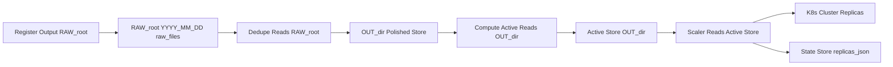
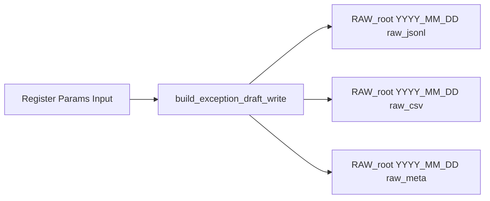
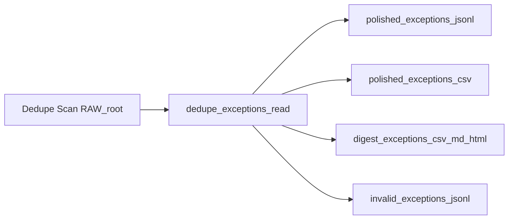
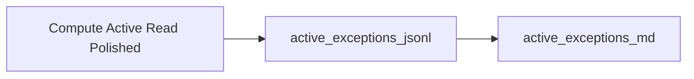
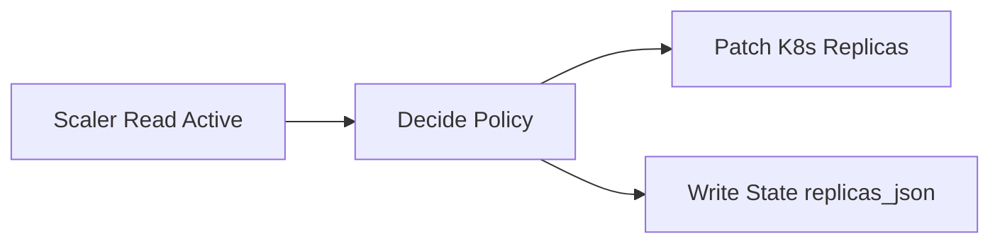
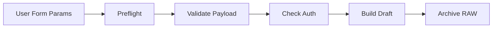
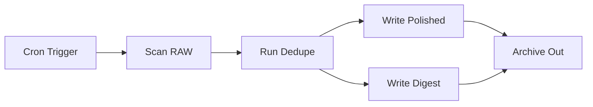
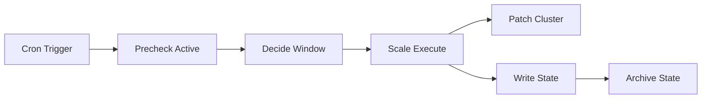
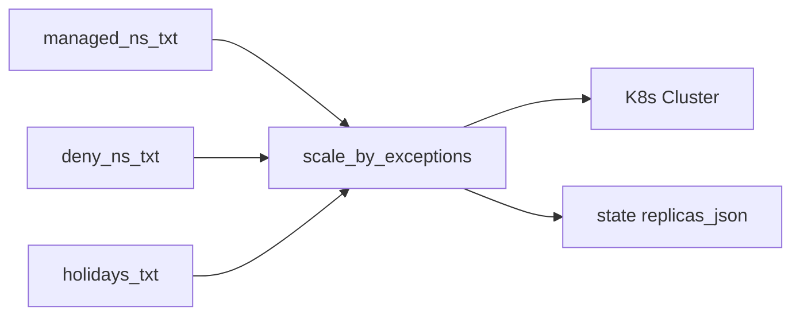

# 5. Cấu trúc thư mục IO

## 5.1 Sơ đồ IO toàn hệ thống



## 5.2 Cây thư mục chuẩn

```text
<workspace>/
  raw/
    YYYY-MM-DD/
      raw-<rid>-<build>.jsonl
      raw-<rid>-<build>.csv
      raw-<rid>-<build>.meta
  out/
    polished_exceptions.jsonl
    polished_exceptions.csv
    invalid_exceptions.jsonl
    digest_exceptions.csv
    digest_exceptions.md
    digest_exceptions.html
    active_exceptions.jsonl
    active_exceptions.md
  state/
    replicas.json
  files/
    managed-ns.txt
    deny-ns.txt
    holidays.txt
```

> Gợi ý mặc định chạy Jenkins
> `RAW_ROOT=/tmp/exceptions/raw` · `OUT_DIR=/tmp/exceptions/out` · `STATE_ROOT=/tmp/exceptions/state`

## 5.3 Quy ước tên file

* **RAW** `raw-<rid>-<build>.<ext>` tại `RAW_ROOT/YYYY-MM-DD/`

  * `<rid>` mã job hoặc run id rút gọn
  * `<build>` số build Jenkins
  * `<ext>` gồm `jsonl` chính, thêm `csv`, `meta` nếu bật
* **Polished** `polished_exceptions.jsonl` `polished_exceptions.csv`
* **Invalid** `invalid_exceptions.jsonl` các dòng RAW bị loại
* **Digest** `digest_exceptions.csv` `digest_exceptions.md` `digest_exceptions.html`
* **Active** `active_exceptions.jsonl` `active_exceptions.md`
* **State** `state/replicas.json`

## 5.4 Luồng IO theo pipeline

### 5.4.1 Register



### 5.4.2 Dedupe



### 5.4.3 Compute Active



### 5.4.4 Scaler



## 5.5 Schema tóm tắt

### RAW jsonl

```json
{ "ts":"2025-09-09T10:01:23+07:00", "requester":"alice", "reason":"uat",
  "on_247":true, "on_out_worktime":false, "end_date":"2025-09-30",
  "workload":{"namespace":"sb-demo","name":"api"},
  "job":{"name":"register","build":128}, "meta":{"kube_context":"gke-dev"} }
```

### Polished jsonl

```json
{ "namespace":"sb-demo","workload":"api","on_247":true,"on_out_worktime":false,
  "end_date":"2025-09-30","requesters":["alice","bob"],
  "reasons":["uat","hotfix"], "source_days":["2025-09-08","2025-09-09"] }
```

### Active jsonl

```json
{ "namespace":"sb-demo","workload":"api","mode":"247",
  "valid_until":"2025-09-30","snapshot_day":"2025-09-09" }
```

### State replicas.json

```json
{ "last_update":"2025-09-09T18:02:11+07:00",
  "items":[{"namespace":"sb-demo","workload":"api","kind":"Deployment",
            "prev_replicas":3,"last_down":"2025-09-09T18:02:11+07:00"}] }
```

## 5.6 Retention và nguyên tắc lưu trữ

* **RAW** dọn theo `RETAIN_DAYS` trong build\_exception\_draft
* **OUT\_DIR** giữ rolling 7 đến 14 ngày hoặc theo nhu cầu báo cáo
* **STATE** không xoá tự động, cần sao lưu trước thay đổi lớn


---

# 6. Biến môi trường theo script

> Quy ước: cột “Mặc định” là giá trị an toàn để chạy thử; muốn chạy thật, override trong Jenkins `environment`.

## 6.1 build-exception-draft.py

|Biến|Mặc định|Ghi chú|
|---|---|---|
|`RAW_ROOT`|`/tmp/exceptions/raw`|Thư mục lưu RAW theo ngày `YYYY-MM-DD`|
|`RETAIN_DAYS`|`90`|Xoá RAW cũ quá N ngày|
|`RETENTION_DRY_RUN`|`0`|`1` chỉ log, không xoá|
|`EXEC_ON_247`|`false`|Bật 24x7|
|`EXEC_ON_OUT`|`true`|Bật ngoài giờ|
|`EXEC_REQUESTER`||Bắt buộc|
|`EXEC_REASON`||Bắt buộc|
|`EXEC_END_DATE`||Bắt buộc `YYYYMMDD` hoặc `YYYY-MM-DD`|
|`EXEC_WORKLOAD_LIST`||Bắt buộc, mỗi dòng `namespace|
|`JOB_NAME`|Jenkins inject|Metadata build|
|`BUILD_URL`|Jenkins inject|Metadata build|
|`BUILD_NUMBER`|Jenkins inject|Metadata build|

**Lưu ý:** Ít nhất một trong `EXEC_ON_247` hoặc `EXEC_ON_OUT` phải bật.

---

## 6.2 validate-exception-payload.py

|Biến|Mặc định|Ghi chú|
|---|---|---|
|`MAX_DAYS_ALLOWED`|`60`|Trần số ngày của `end_date`|
|`TZ`|`Asia/Bangkok`|Múi giờ chuẩn|
|`TODAY`||Override ngày chạy khi test, `YYYY-MM-DD`|
|`EXEC_ON_247`|`false`|Tham chiếu kiểm tra|
|`EXEC_ON_OUT`|`false`|Tham chiếu kiểm tra|

---

## 6.3 validate-kube-auth.py

|Biến|Mặc định|Ghi chú|
|---|---|---|
|`KUBECONFIG_FILE`||File kubeconfig do user upload|
|`KUBE_CONTEXT`||Chỉ định context cụ thể|
|`EXEC_NS_LIST`||Danh sách namespace một dòng một giá trị|
|`EXEC_WORKLOAD_LIST`||Nếu có, parser strict sẽ suy ra ns|
|`MANAGED_NS_FILE`|`files/managed-ns.txt`|Regex mỗi dòng|
|`STRICT_PATCH`|`0`|`1` bắt buộc quyền patch scale ở mọi ns liên quan|
|`ALLOW_UNKNOWN_NS`|`0`|`1` bỏ qua ns ngoài quản lý|
|`DEBUG`|`0`|Verbose log|

---

## 6.4 dedupe_exceptions.py

|Biến|Mặc định|Ghi chú|
|---|---|---|
|`RAW_ROOT`|`/tmp/exceptions/raw`|Nguồn RAW|
|`OUT_DIR`|`/tmp/exceptions/out`|Đích polished và digest|
|`LOOKBACK_DAYS`|`90`|Quét RAW trong N ngày|
|`MAX_DAYS`|`60`|Cửa sổ hiệu lực tính từ ngày chạy|
|`TODAY`||Override ngày chạy|
|`FILTER_NS`||Chỉ lấy một ns|
|`FILTER_WL`||Chỉ lấy một workload|
|`DEBUG`|`0`|Verbose log|
|`DEBUG_DUMP_RAW`|`0`|Dump từng dòng RAW|
|`DEBUG_DUMP_GROUPS`|`0`|Dump nhóm sau gom|

---

## 6.5 compute-active-exceptions.py

|Biến|Mặc định|Ghi chú|
|---|---|---|
|`OUT_DIR`|`/tmp/exceptions/out`|Đọc polished, ghi active|
|`MAX_DAYS`|`60`|Bảo vệ cửa sổ ngày|
|`TODAY`||Override ngày chạy|
|`DEBUG`|`0`|Verbose log|

---

## 6.6 scale-by-exceptions.py

|Biến|Mặc định|Ghi chú|
|---|---|---|
|`OUT_DIR`|`/tmp/exceptions/out`|Đọc `active_exceptions.jsonl`|
|`STATE_ROOT`|`/tmp/exceptions/state`|Lưu `state/replicas.json`|
|`TZ`|`Asia/Bangkok`|Múi giờ chuẩn|
|`MANAGED_NS_FILE`|`files/managed-ns.txt`|Regex ns được quản lý|
|`DENY_NS_FILE`|`files/deny-ns.txt`|Danh sách ns loại trừ|
|`HOLIDAYS_FILE`|`files/holidays.txt`|Danh sách ngày nghỉ|
|`HOLIDAY_MODE`|`hard_off`|`hard_off` để down tất cả vào holiday|
|`ACTION`|`auto`|`auto` hoặc `weekday_prestart` `weekday_enter_out` `weekend_pre` `weekend_close`|
|`TARGET_DOWN`|`0`|Replica khi DOWN|
|`DEFAULT_UP`|`1`|Replica mặc định khi UP nếu không có HPA|
|`DOWN_HPA_HANDLING`|`skip`|`skip` tôn trọng minReplicas, `force` ép xuống trong cửa sổ bắt buộc|
|`HYST_MIN`|`3`|Biên ± phút quanh mốc giờ|
|`JITTER_UP_BULK_S`|`5`|Ngẫu nhiên 0..N giây khi UP hàng loạt buổi sáng|
|`JITTER_UP_EXC_S`|`2`|Ngẫu nhiên 0..N giây khi UP theo ngoại lệ|
|`JITTER_DOWN_S`|`1`|Ngẫu nhiên 0..N giây khi DOWN|
|`KUBECTL_TIMEOUT`|`10s`|Timeout cho lệnh kubectl|
|`MAX_ACTIONS_PER_RUN`|`0`|0 là không giới hạn, >0 để giới hạn blast radius|
|`DRY_RUN`|`0`|`1` chỉ in lệnh, không scale thật|
|`KUBE_CONTEXT`||Chọn context cụ thể|

> **Tương thích cũ:** nếu còn biến `JITTER_MAX_S`, map sang `JITTER_UP_BULK_S` khi biến mới chưa set.

---

## 6.7 Khối ENV mẫu theo pipeline

### Register

```bash
RAW_ROOT=/tmp/exceptions/raw \
TZ=Asia/Bangkok \
EXEC_ON_OUT=true EXEC_ON_247=false \
EXEC_REQUESTER=alice EXEC_REASON="uat cutover" \
EXEC_END_DATE=2025-09-30 \
EXEC_WORKLOAD_LIST="sb-demo | api\nsb-demo | fe" \
python3 exception-ontime/scripts/build-exception-draft.py
```

### Dedupe

```bash
RAW_ROOT=/tmp/exceptions/raw \
OUT_DIR=/tmp/exceptions/out \
LOOKBACK_DAYS=60 MAX_DAYS=60 \
python3 exception-ontime/scripts/dedupe_exceptions.py
```

### Compute Active

```bash
OUT_DIR=/tmp/exceptions/out \
MAX_DAYS=60 \
python3 exception-ontime/scripts/compute-active-exceptions.py
```

### Scaler

```bash
OUT_DIR=/tmp/exceptions/out \
STATE_ROOT=/tmp/exceptions/state \
MANAGED_NS_FILE=exception-ontime/files/managed-ns.txt \
DENY_NS_FILE=exception-ontime/files/deny-ns.txt \
HOLIDAYS_FILE=exception-ontime/files/holidays.txt \
TZ=Asia/Bangkok ACTION=auto DRY_RUN=1 \
python3 exception-ontime/scripts/scale-by-exceptions.py
```

---

# 7. Pipelines Jenkins

## 7.1 Register Pipeline

**Mục tiêu**: Thu nhận yêu cầu ngoại lệ và ghi RAW.

**Parameters**

* `EXEC_ON_247` bool
* `EXEC_ON_OUT` bool
* `EXEC_REQUESTER` string
* `EXEC_REASON` string
* `EXEC_END_DATE` string
* `EXEC_WORKLOAD_LIST` text multiline
* `USER_KUBECONFIG` file parameter

**ENV mẫu**

```
RAW_ROOT=/tmp/exceptions/raw
TZ=Asia/Bangkok
```

**Stages**

1. **Preflight**

   * Set display name, log thông số, kiểm tra tham số bắt buộc.
2. **Validate Payload**

   * `python3 scripts/validate-exception-payload.py`
3. **Check Auth**

   * withFileParameter `USER_KUBECONFIG` → export `KUBECONFIG_FILE`
   * `python3 scripts/validate-kube-auth.py`
4. **Build Draft**

   * `python3 scripts/build-exception-draft.py`
5. **Archive RAW**

   * Archive artifacts `raw/YYYY-MM-DD/raw-*`

**Trigger**: thủ công.

**Concurrency**

* `disableConcurrentBuilds()` **không bắt buộc** cho register, nhưng khuyến nghị nếu workspace dùng chung.

**Artifacts**

* `raw-*.jsonl,csv,meta` dưới `RAW_ROOT/YYYY-MM-DD/`.

**Mermaid**



---

## 7.2 Dedupe Pipeline

**Mục tiêu**: Gom RAW, xuất Polished và Digest.

**ENV mẫu**

```
RAW_ROOT=/tmp/exceptions/raw
OUT_DIR=/tmp/exceptions/out
LOOKBACK_DAYS=90
MAX_DAYS=60
TZ=Asia/Bangkok
```

**Stages**

1. **Scan RAW**

   * Kiểm tra `RAW_ROOT` và ngày hôm nay.
2. **Run Dedupe**

   * `python3 scripts/dedupe_exceptions.py`
3. **Publish Digest**

   * `cat out/digest_exceptions.md` để hiển thị console
   * Archive `digest_exceptions.* polished_exceptions.* invalid_exceptions.jsonl`

**Trigger**

* `cron: */10 * * * *`

**Concurrency**

* Cho phép chạy song song nếu IO tách bạch; nếu dùng chung `OUT_DIR`, nên `disableConcurrentBuilds()`.

**Artifacts**

* `polished_exceptions.jsonl,csv`
* `digest_exceptions.csv,md,html`
* `invalid_exceptions.jsonl`

**Mermaid**



---

## 7.3 Scaler Pipeline

**Mục tiêu**: Áp chính sách và scale workload.

**Parameters**

* `SCALE_ACTION` choice `{auto, weekday_prestart, weekday_enter_out, weekend_pre, weekend_close}`

**ENV mẫu**

```
OUT_DIR=/tmp/exceptions/out
STATE_ROOT=/tmp/exceptions/state
MANAGED_NS_FILE=exception-ontime/files/managed-ns.txt
DENY_NS_FILE=exception-ontime/files/deny-ns.txt
HOLIDAYS_FILE=exception-ontime/files/holidays.txt
TZ=Asia/Bangkok
ACTION=auto
DOWN_HPA_HANDLING=skip
TARGET_DOWN=0
DEFAULT_UP=1
HYST_MIN=3
JITTER_UP_BULK_S=5
JITTER_UP_EXC_S=2
JITTER_DOWN_S=1
KUBECTL_TIMEOUT=10s
DRY_RUN=1
```

**Stages**

1. **Precheck**

   * Kiểm tra tồn tại `active_exceptions.jsonl`
   * Nếu không có, tùy chính sách có thể chạy `compute-active-exceptions.py`
2. **Decide Window**

   * Tính time window theo `TZ`, kiểm tra `HOLIDAYS_FILE`
3. **Scale Execute**

   * withCredentials file kubeconfig → export `KUBECONFIG_FILE`
   * `python3 scripts/scale-by-exceptions.py`
4. **Publish State**

   * Archive `state/replicas.json`

**Trigger**

* `cron: H/10 * * * *` (hash distributed)

**Concurrency**

* **Bắt buộc** `disableConcurrentBuilds()` để tránh race trên `state/replicas.json` và lệnh kubectl.

**Artifacts**

* `state/replicas.json`

**Mermaid**



---

## 7.4 Quy tắc chung Jenkins

**Thư viện và Runtime**

* Python 3.x nhất quán giữa các job. Nếu môi trường có cả `python3` và `python3.9`, chuẩn hóa lại command.
* Kubectl cùng phiên bản major với cluster, context cấu hình rõ ràng.

**Proxy và TZ**

* Đặt `TZ=Asia/Bangkok` tại `environment`.
* Nếu có proxy, cấu hình `HTTP_PROXY HTTPS_PROXY NO_PROXY` nhất quán.

**DRY RUN**

* Scaler nên giữ `DRY_RUN=1` vài chu kỳ đầu sau khi thay đổi lớn.

**Quan sát**

* In `digest_exceptions.md` ra console của dedupe.
* Log scaler tóm tắt số workload UP DOWN và bị bỏ qua do deny hoặc HPA.

**Thông báo**

* Tùy chọn gửi digest qua chat ops bằng job phụ, sử dụng `digest_exceptions.html` hoặc `.md`.

---
Rõ ⚔️. Viết **Phần 8 – Mẫu cấu hình kèm repo** chi tiết, kèm Mermaid mô tả nơi các file được sử dụng.

---

# 8. Mẫu cấu hình kèm repo

## 8.1 `files/managed-ns.txt`

* **Mục đích**: danh sách namespace **được phép** scaler quản lý. Mỗi dòng là **regex**.
* **Quy tắc**:

  * Một dòng một regex.
  * Ưu tiên regex chặt chẽ, dùng `^` và `$` khi có thể.
  * Không trùng khớp với `deny-ns.txt`.

**Ví dụ cơ bản**

```
^sb-.*$
^core-platform$
^payments-(dev|uat|prod)$
```

**Ví dụ theo nhóm môi trường**

```
^sb-.*-(dev|qa)$
^sb-.*-uat$
^sb-.*-prod$
```

> Gợi ý: nếu hệ thống nhiều team, tách block theo chú thích kèm mã đội để tiện review.

---

## 8.2 `files/deny-ns.txt`

* **Mục đích**: danh sách namespace **không** bị scaler động vào, bất kể ngoại lệ.
* **Quy tắc**:

  * Một dòng một tên ns hoặc regex.
  * Dùng cho hệ thống hạ tầng, quản trị, giám sát, dữ liệu nhạy cảm.

**Ví dụ**

```
^kube-system$
^monitoring$
^logging$
^sb-awx$
^sb-trino$
```

> Deny thắng Managed: nếu một ns match cả `managed-ns` và `deny-ns`, **bị loại trừ**.

---

## 8.3 `files/holidays.txt`

* **Mục đích**: ngày nghỉ lễ, nếu `HOLIDAY_MODE=hard_off` thì **DOWN tất cả**.
* **Quy tắc**:

  * Một dòng một ngày `YYYY-MM-DD`.
  * Không có khoảng trắng thừa, không comment trong dòng.

**Ví dụ**

```
2025-01-01
2025-04-30
2025-05-01
2025-09-02
```

> Có thể bổ sung ngày nghỉ bù theo lịch tổ chức nội bộ.

---

## 8.4 Bộ mẫu theo môi trường

```
managed-ns.txt
^sb-.*-dev$
^sandbox-.*$

deny-ns.txt
^sb-awx$
^kube-system$

holidays.txt
2025-01-01
```

---

## 8.5 Mermaid vị trí sử dụng các file cấu hình



---

## 8.6 Nguyên tắc soạn file và kiểm tra nhanh

**Soạn thảo**

* Mã hóa **UTF-8**, kết thúc file có newline.
* Không BOM, không tab lẫn lộn với spaces.
* Với regex, tránh ký tự mơ hồ; test trước bằng `grep -E`.

**Kiểm tra nhanh**

```bash
# Kiểm tra regex managed khớp ns
grep -E -f files/managed-ns.txt <(kubectl get ns -o jsonpath='{.items[*].metadata.name}' | tr ' ' '\n')

# Kiểm tra deny chặn đủ ns nhạy cảm
grep -E -f files/deny-ns.txt <(kubectl get ns -o jsonpath='{.items[*].metadata.name}' | tr ' ' '\n')

# Kiểm tra định dạng ngày holiday
awk -F- 'NF!=3 || length($1)!=4 || length($2)!=2 || length($3)!=2 {print "Invalid:", $0}' files/holidays.txt
```

**Quy tắc va chạm**

* Nếu một ns match **deny** → loại trừ, dù có match **managed**.
* Nếu một workload được nêu trong **active\_exceptions** nhưng ns nằm trong **deny** → bỏ qua action cho workload đó, log cảnh báo.


---

# 9. Quy trình kiểm chứng trước chạy thật

## 9.1 Tiền đề bắt buộc

Trước khi cho phép pipeline Scaler chạy thật, phải xác nhận các yếu tố nền tảng:

* **Phiên bản**

  * `python3 --version` ≥ 3.9
  * `kubectl version --short` tương thích major với cluster
* **Quyền hạn**

  * Jenkins credential kubeconfig phải có quyền `patch` trên `deployments` và `statefulsets`.
  * Kiểm chứng:

    ```bash
    kubectl auth can-i patch deploy --all-namespaces
    kubectl auth can-i patch statefulset --all-namespaces
    ```
* **Thời gian hệ thống**

  * `date` phải ở timezone `Asia/Bangkok`.
  * Nếu khác, override bằng `TZ=Asia/Bangkok`.
* **Cluster policies**

  * HPA, PDB, autoscaler không xung đột với hành động scale.
  * Nếu có PDB strict, đảm bảo không gây block khi scale xuống.

---

## 9.2 Preflight chạy tay

Thực hiện pipeline theo thứ tự với **DRY\_RUN=1** để quan sát:

### 1. Build Draft

```bash
RAW_ROOT=/tmp/exceptions/raw \
EXEC_REQUESTER=demo EXEC_REASON=test \
EXEC_END_DATE=2025-09-30 EXEC_ON_OUT=true \
EXEC_WORKLOAD_LIST="sb-demo | api" \
python3 scripts/build-exception-draft.py
```

### 2. Dedupe

```bash
RAW_ROOT=/tmp/exceptions/raw OUT_DIR=/tmp/exceptions/out \
python3 scripts/dedupe_exceptions.py
```

### 3. Compute Active

```bash
OUT_DIR=/tmp/exceptions/out \
python3 scripts/compute-active-exceptions.py
```

### 4. Scaler DRY RUN

```bash
ACTION=auto DRY_RUN=1 \
OUT_DIR=/tmp/exceptions/out STATE_ROOT=/tmp/exceptions/state \
MANAGED_NS_FILE=files/managed-ns.txt DENY_NS_FILE=files/deny-ns.txt \
HOLIDAYS_FILE=files/holidays.txt TZ=Asia/Bangkok \
python3 scripts/scale-by-exceptions.py
```

---

## 9.3 Kiểm tra kết quả

* `raw/*.jsonl`: có bản ghi yêu cầu đúng requester, reason, end\_date.
* `polished_exceptions.jsonl`: đã gộp và chọn end\_date xa nhất.
* `digest_exceptions.md`: hiển thị console, dễ đọc.
* `active_exceptions.jsonl`: snapshot đúng ngày, mode hợp lệ.
* Log Scaler DRY RUN: in rõ số workload được UP, DOWN, bỏ qua.

---

## 9.4 Rollback

* File `state/replicas.json` lưu replicas trước khi DOWN.
* Khi cần khôi phục:

  ```bash
  kubectl scale deploy -n <ns> <workload> --replicas=<prev_replicas>
  ```
* Hoặc chạy Scaler với `ACTION=weekday_prestart` để UP toàn bộ.

> **Quy tắc an toàn**: không xoá file `state/replicas.json` trừ khi có backup.

---

## 9.5 Checklist cuối

* [ ] Phiên bản python3 và kubectl đúng.
* [ ] Quyền patch deploy/statefulset đầy đủ.
* [ ] Timezone chính xác.
* [ ] RAW → Polished → Active đã sinh ra file đúng.
* [ ] Scaler DRY RUN log hợp lệ.
* [ ] State file có dữ liệu replicas để rollback.

---

Rõ ⚔️. Thuộc hạ triển khai **Phần 10 – Quy tắc an toàn tác chiến** để chốt sổ tài liệu.

---

# 10. Quy tắc an toàn tác chiến

## 10.1 DRY RUN trước khi thực chiến

* Luôn bật `DRY_RUN=1` ít nhất 3–5 chu kỳ cron đầu sau khi chỉnh sửa code, policy hoặc file cấu hình.
* Đọc log Scaler: kiểm tra số workload được UP/DOWN có hợp lý.
* Chỉ khi log ổn định và digest chuẩn thì mới gỡ `DRY_RUN`.

---

## 10.2 Theo dõi digest hằng ngày

* Mỗi ngày kiểm tra:

  * `digest_exceptions.md` (đọc trong console hoặc Webex digest).
  * `active_exceptions.md` (snapshot hiệu lực).
* Đối chiếu với danh sách workload quan trọng để chắc chắn không có nhầm.

---

## 10.3 Sao lưu và phục hồi State

* File `state/replicas.json` là bảo hiểm.
* Trước khi đổi logic lớn (ví dụ thêm holiday policy, sửa jitter), hãy copy file state.
* Nếu scaler lỡ DOWN nhầm, khôi phục bằng:

  ```bash
  kubectl scale deploy -n <ns> <workload> --replicas=<prev_replicas>
  ```

  hoặc chạy Scaler với `ACTION=weekday_prestart`.

---

## 10.4 Kiểm soát thay đổi

* Bất kỳ thay đổi nào ở `managed-ns.txt`, `deny-ns.txt`, `holidays.txt` phải được code review.
* Update ngày lễ cần commit sớm (ít nhất 1 tuần trước kỳ nghỉ).
* Sau mỗi thay đổi quan trọng, chạy lại toàn bộ quy trình kiểm chứng (Phần 9).

---

## 10.6 Checklist an toàn trước mỗi lần triển khai

* [ ] DRY RUN bật sẵn, log ổn định.
* [ ] Digest được review hằng ngày.
* [ ] State file có backup.
* [ ] Jenkins job scaler có `disableConcurrentBuilds()` bật.
